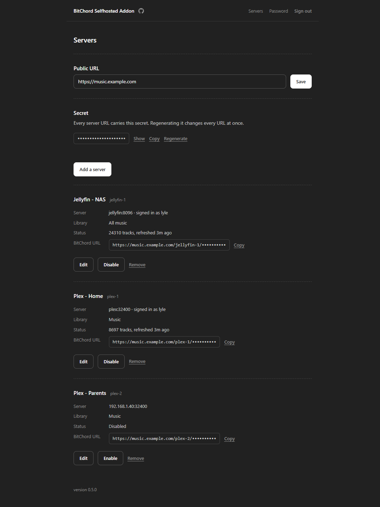
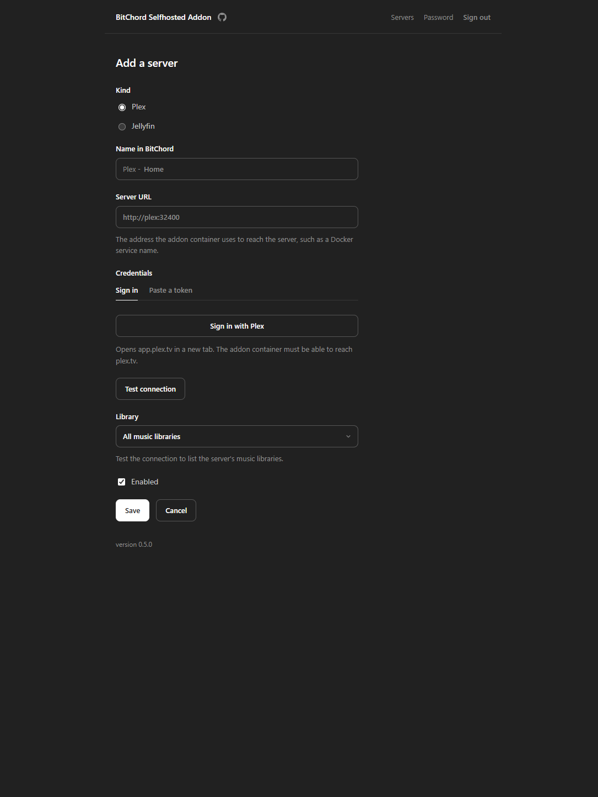

<h1 align="center">bitchord-selfhosted-addon</h1>

<p align="center">
  Play your own Plex and Jellyfin music libraries inside BitChord.
</p>

<div align="center">
  <video src="https://github.com/user-attachments/assets/54e40931-afd8-49c3-ab2f-c6598f182081" width="320" controls></video>
</div>

## 🎵 What it is

A small self-hosted server that adds your Plex and Jellyfin music libraries
to BitChord (Android) as sources. BitChord searches your library through the
addon and streams your original files.

BitChord prefers addons you add over its built-in sources, so when a song is
in your library, your own copy plays.

## ✨ Features

- **Set up in the browser.** Open `/setup`, choose a password, add your
  servers, and copy each one's link into BitChord.
- **Any number of servers.** Each Plex or Jellyfin server gets its own link
  and shows up in BitChord as its own source.
- **Fast search.** The addon keeps a list of your tracks in memory, about
  30–50 MB for 100,000 tracks.
- **Original quality.** Your files are streamed as they are, with seeking.
- **Private.** Your Plex and Jellyfin tokens never leave the addon, and every
  link contains a secret.

<p align="center">
  
  
</p>

## 📋 Requirements

- Docker.
- A Plex server, or Jellyfin 10.9 or newer, that the addon can reach.
- HTTPS, which BitChord requires. Use a reverse proxy such as Caddy, Traefik
  or nginx, or a
  [Cloudflare Tunnel](https://developers.cloudflare.com/cloudflare-one/connections/connect-networks/).
- For **Sign in with Plex**, the addon must reach `plex.tv`. Pasting a token
  works without it.

## 🚀 Setup

1. **Add the service to your `compose.yml`**, or start from
   [`compose.example.yml`](compose.example.yml).

   ```yaml
   services:
     bitchord-selfhosted-addon:
       image: ghcr.io/rairulyle/bitchord-selfhosted-addon:latest
       ports:
         - "8080:8080"
       volumes:
         - </path/to/your/data>:/data
       restart: unless-stopped
       networks:
         - proxy

   networks:
     proxy:
       external: true
       name: replace-with-your-reverse-proxy-network
   ```

   The container runs as user `65532`, so give it the data folder first:
   `sudo chown 65532 </path/to/your/data>`.

2. **Connect it to HTTPS.** Set the network name to the one your reverse
   proxy uses, and point the proxy at `bitchord-selfhosted-addon:8080` for a
   host such as `music.example.com`. If only the proxy needs to reach the
   addon, you can remove the `ports:` lines.

3. **Start it.**

   ```bash
   docker compose up -d
   ```

4. **Open `https://music.example.com/setup` and choose a password.** Do this
   right away: until a password is set, anyone who opens the page can claim
   it.

5. **Set the public URL** (`https://music.example.com`), then **add a
   server**: pick Plex or Jellyfin, sign in or paste a token, test the
   connection, optionally pick a library, and save.

6. **Add it to BitChord.** Copy the link from the server's card. In
   BitChord, open **Sources**, add an addon, and paste it.

To update, run `docker compose pull` and then `docker compose up -d`.

### Upgrading from v0.4

Settings moved from `.env` to the setup page and are now saved in `/data`.
Before pulling the new image:

1. **Add a data volume** to the service, as in the setup example above:

   ```yaml
   volumes:
     - </path/to/your/data>:/data
   ```

   Without it, your password, secret and servers are lost whenever the
   container is recreated.

2. **Remove `env_file: .env`** from the service and delete `.env`. Compose
   won't start if `env_file` points to a missing file.

3. **Set it up again.** Pull the image, start it, open `/setup`, and add your
   server. Then replace the old link in BitChord with the new one.

## ⚙️ Configuration

Everything is saved in `/data/addon.json`, including your server tokens, so
keep that folder private.

These optional environment variables are the only other settings:

| Variable           | Default | Meaning                                  |
| ------------------ | ------- | ---------------------------------------- |
| `REFRESH_INTERVAL` | `15m`   | How often to re-read your libraries      |
| `PORT`             | `8080`  | Port the addon listens on                |
| `LOG_LEVEL`        | `info`  | `debug`, `info`, `warn` or `error`       |
| `LOG_FORMAT`       | `text`  | `text`, or `json` for log collectors     |

## 📱 Using it in BitChord

Each server's link looks like this:

```
https://music.example.com/plex-1/<secret>
```

Add one link per server under **Sources**. If an app asks for a manifest URL,
add `/manifest.json` to the end.

BitChord tries sources from top to bottom. Put your servers first so your own
files play, and anything not in your library falls through to the next
source. Drag a source by its handle to reorder it, or use its toggle to turn
it off.

> [!WARNING]
> Treat each link like a password: anyone who has it can stream that
> library. To revoke every link at once, regenerate the secret on the setup
> page and add the new links to BitChord.

## 🔀 Reverse proxy notes

Turn off response buffering, so seeking and skipping stay fast.

- **Caddy** and **Traefik** work as they are.
- **nginx:**

  ```nginx
  location / {
      proxy_pass http://bitchord-selfhosted-addon:8080;
      proxy_buffering off;
      proxy_request_buffering off;
      proxy_http_version 1.1;
      proxy_read_timeout 1h;
      proxy_set_header X-Forwarded-Proto $scheme;
      proxy_set_header X-Forwarded-For $proxy_add_x_forwarded_for;
  }
  ```

After five wrong passwords in a minute, the setup page pauses logins for a
minute. Behind a proxy this pause applies to everyone.

## 📜 Logs

At the default level the addon logs searches, plays and setup changes:

```
msg=search server=plex-1 source=plex q="timebomb all time low" returned=1 top="Time‐Bomb — All Time Low"
msg=play server=plex-1 source=plex id=5820 track="Time‐Bomb — All Time Low" status=206 ended=complete
msg="library indexed" server=plex-1 source=plex tracks=8697 added=12 removed=0
```

A `search` with results but no `stream` after it means BitChord decided the
match was wrong (a different title, version, artist or length). BitChord
never searches for titles with no Latin letters or digits, such as
`夜に駆ける`.

Search text is logged, so the logs show what was played. They stay on your
server. Passwords, tokens and the secret are never logged.

## 🛠️ Troubleshooting

| Problem                                      | What to do                                                                                        |
| -------------------------------------------- | ------------------------------------------------------------------------------------------------- |
| The setup page asks for a password I never set | Someone else got there first. Delete the `admin` entry in `/data/addon.json` and restart           |
| My servers are gone after an update          | The `/data` volume is missing or changed. Check `compose.yml`                                      |
| Log says `cannot open the data file`         | The addon can't write `/data`, or `addon.json` is broken. Fix the folder owner or the file         |
| Log says Plex or Jellyfin rejected the token | The token was revoked. Edit the server on the setup page and sign in again                         |
| Sign in with Plex can't reach plex.tv        | Paste a token instead                                                                             |
| A server shows as unreachable                | Enter an address the container can reach, such as a Docker service name                           |
| Search works but playback fails              | Your reverse proxy is buffering or timing out. See the reverse proxy notes                         |
| A new album doesn't show up                  | Wait for the next refresh, or disable and re-enable the server on the setup page                  |

## 🗺️ Roadmap

- **Emby** support.
- **Navidrome** and other Subsonic-compatible servers.

## 🧑‍💻 Development

```bash
go test -race ./...
gofmt -l . && go vet ./...
```

Tests use fake Plex, Jellyfin and plex.tv servers in `internal/fakes`, so no
real server is needed.

### Releasing

`CHANGELOG.md` is the source of truth for release notes. Move the
`## [Unreleased]` entries into a `## [X.Y.Z] - YYYY-MM-DD` section, commit,
then tag and push:

```bash
git tag vX.Y.Z
git push origin vX.Y.Z
```

The workflow checks the changelog, runs the tests, pushes the image to GHCR
(`latest`, `X.Y.Z`, `X.Y`) and creates the GitHub release. Preview the notes
with `scripts/release-notes.sh vX.Y.Z`.

## 📄 License

[MIT](LICENSE)
